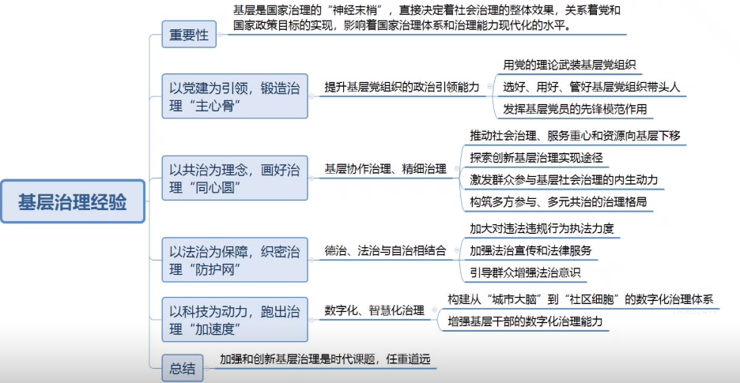

### 产业发展

【降本增效】【提产增收】【做到因地制宜，明确规划布局】

【产品缺乏优势】【用户粘性不足】【发展集体经济】【发展旅游业】

【配置农机设备】【提供租赁服务】【提供农业保险服务】【发展文创产业】

【销售渠道拓宽】【实时性、互动性强】【卫生环境改善】【环保意识提升】

【建立溯源机制】【尊重市场规律】【创新宣传方式】【扩大宣传范围】

【提升产品认可度】【统一生产标准】【引进智能设备】

***

### 基层治理

【干部下沉】【加强政务公开】【智慧化服务】【精细化治理】

【打破信息壁垒】【动态管理】【一站式服务】【完善奖惩机制】

【宣传先进典型】【拓宽引才渠道】【明确权责】【强化村民主人翁意识】

【群众自治】【坚持公平公正】【政务服务下沉】

